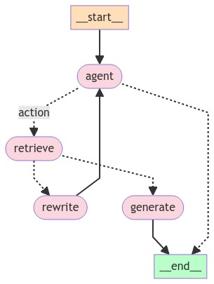

# 第1部分：构建基本聊天机器人

我们将首先使用LangGraph创建一个简单的聊天机器人。这个聊天机器人将直接响应用户消息。虽然很简单，但它将说明使用LangGraph构建的核心概念。在本节结束时，您将拥有一个构建的基本聊天机器人。

首先创建一个StateGraph。StateGraph对象将聊天机器人的结构定义为“状态机”。我们将添加节点来表示聊天机器人可以调用的llm和函数，并添加边来指定机器人应该如何在这些函数之间转换。

```python
from typing import Annotated

from typing_extensions import TypedDict

from langgraph.graph import StateGraph
from langgraph.graph.message import add_messages


class State(TypedDict):
    # Messages have the type "list". The `add_messages` function
    # in the annotation defines how this state key should be updated
    # (in this case, it appends messages to the list, rather than overwriting them)
    messages: Annotated[list, add_messages]


graph_builder = StateGraph(State)
```

请注意，我们已经将State定义为一个带有单个键的TyedDict：消息。messsages键使用add\_messages函数进行Annotated注释，该函数告诉LangGraph将新消息附加到现有列表中，而不是覆盖它。

所以现在我们的图表知道了两件事：

1.我们定义的每个节点都将接收当前状态作为输入并返回一个更新该状态的值。

2.messages将被附加到当前列表，而不是直接覆盖。这是通过Annotated注释语法中的预构建add\_messages函数进行通信的。

接下来，添加一个“chatbot”节点。节点代表工作单元。它们通常是常规的python函数。

```python
from langchain_anthropic import ChatAnthropic

llm = ChatAnthropic(model="claude-3-haiku-20240307")


def chatbot(state: State):
    return {"messages": [llm.invoke(state["messages"])]}


# The first argument is the unique node name
# The second argument is the function or object that will be called whenever
# the node is used.
graph_builder.add_node("chatbot", chatbot)
```

请注意chatbot节点函数如何将当前状态State作为输入并返回更新的消息messages列表。这是所有LangGraph节点函数的基本模式。

我们状态State中的add\_messages函数将把llm的响应消息附加到state.

接下来，添加一个切入点entry。这告诉我们的图每次运行时从哪里开始工作。

```python
graph_builder.set_entry_point("chatbot")
```

同样，设置一个终点finish。这指示图表“任何时候运行此节点，您都可以退出”。

```python
graph_builder.set_finish_point("chatbot")
```

最后，我们希望能够运行我们的图形。为此，请在图形构建器上调用“compile()”。这将创建一个“CompiledGraph”，我们可以在我们的状态上使用调用。

```python
graph = graph_builder.compile()
```

您可以使用get\_graph方法和“绘制”方法之一（如draw\_ascii或draw\_png）可视化图形。每个绘制方法都需要额外的依赖项。

```python
from IPython.display import Image, display

try:
    display(Image(graph.get_graph().draw_mermaid_png()))
except Exception:
    # This requires some extra dependencies and is optional
    pass
```

<figure><figcaption></figcaption></figure>

现在让我们运行聊天机器人！

提示：您可以随时通过键入“退出”、“退出”或“q”退出聊天循环。

```python
while True:
    user_input = input("User: ")
    if user_input.lower() in ["quit", "exit", "q"]:
        print("Goodbye!")
        break
    for event in graph.stream({"messages": ("user", user_input)}):
        for value in event.values():
            print("Assistant:", value["messages"][-1].content)
```

```
User:  what's langgraph all about?
```

```
Assistant: Langgraph is a new open-source deep learning framework that focuses on enabling efficient training and deployment of large language models. Some key things to know about Langgraph:

1. Efficient Training: Langgraph is designed to accelerate the training of large language models by leveraging advanced optimization techniques and parallelization strategies.

2. Modular Architecture: Langgraph has a modular architecture that allows for easy customization and extension of language models, making it flexible for a variety of NLP tasks.

3. Hardware Acceleration: The framework is optimized for both CPU and GPU hardware, allowing for efficient model deployment on a wide range of devices.

4. Scalability: Langgraph is designed to handle large-scale language models with billions of parameters, enabling the development of state-of-the-art NLP applications.

5. Open-Source: Langgraph is an open-source project, allowing developers and researchers to collaborate, contribute, and build upon the framework.

6. Performance: The goal of Langgraph is to provide superior performance and efficiency compared to existing deep learning frameworks, particularly for training and deploying large language models.

Overall, Langgraph is a promising new deep learning framework that aims to address the challenges of building and deploying advanced natural language processing models at scale. It is an active area of research and development, with the potential to drive further advancements in the field of language AI.
```

```
User:  hm that doesn't seem right...
```

```
Assistant: I'm sorry, I don't have enough context to determine what doesn't seem right. Could you please provide more details about what you're referring to? That would help me better understand and respond appropriately.
```

```
User:  q
```

```
Goodbye!
```

恭喜！您已经使用LangGraph构建了您的第一个聊天机器人。该机器人可以通过获取用户输入并使用LLM生成响应来参与基本对话。您可以通过提供的链接查看上面呼叫的LangSmith Trace。

但是，您可能已经注意到机器人的知识仅限于训练数据中的内容。在下一部分中，我们将添加一个网络搜索工具来扩展机器人的知识并使其更有能力。

以下是本节的完整代码供您参考：

```python
from typing import Annotated

from langchain_anthropic import ChatAnthropic
from typing_extensions import TypedDict

from langgraph.graph import StateGraph
from langgraph.graph.message import add_messages


class State(TypedDict):
    messages: Annotated[list, add_messages]


graph_builder = StateGraph(State)


llm = ChatAnthropic(model="claude-3-haiku-20240307")


def chatbot(state: State):
    return {"messages": [llm.invoke(state["messages"])]}


# The first argument is the unique node name
# The second argument is the function or object that will be called whenever
# the node is used.
graph_builder.add_node("chatbot", chatbot)
graph_builder.set_entry_point("chatbot")
graph_builder.set_finish_point("chatbot")
graph = graph_builder.compile()
```

